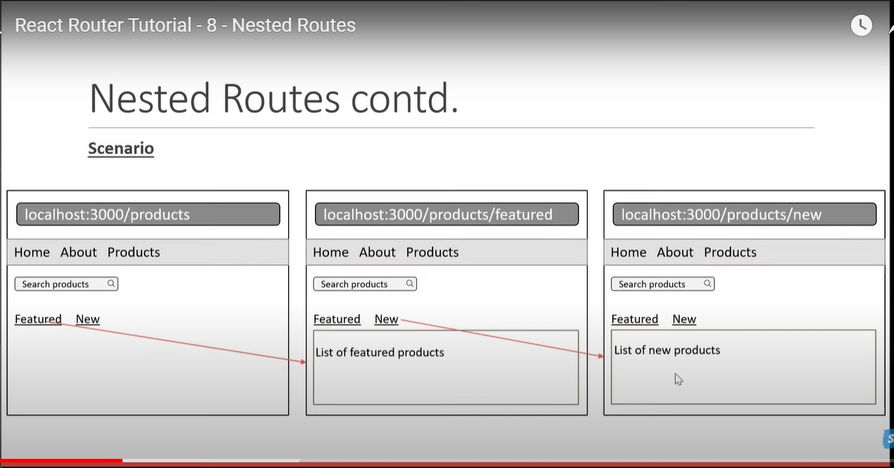

# How to use react-router

## App.js

```js
import React from "react";
import { BrowserRouter as Router } from "react-router-dom";
import NavigationBar from "./Pages/NavigationBar";
import MyRoute from "./Pages/MyRoute";

function App() {
  return (
    <div>
      <Router>
        <NavigationBar />
        <MyRoute />
      </Router>
    </div>
  );
}
export default App;
```

## MyRoute.js

```js
import React from "react";
import { Routes, Route } from "react-router-dom";
import Home from "./Home";
import Profile from "./Profile";
import About from "./About";
import NoMatchRoute from "../body/NoMatchRoute";

function MyRoute() {
  return (
    <Routes>
      <Route path="/" element={<Home />} />
      <Route path="/about" element={<About />} />
      <Route path="/profile" element={<Profile />} />
      <Route path="*" element={<NoMatchRoute />} />
    </Routes>
  );
}
export default MyRoute;
```

## NavigationBar.js (or Link any nav)

```js
import React from "react";
import { Link } from "react-router-dom";

function NavigationBar() {
  return (
    <div>
      <Link to="/">Home</Link>
      <Link to="/about">About</Link>
      <Link to="profile">Profile</Link>
    </div>
  );
}
export default NavigationBar;
```

## Use Navigate

- When click button navigate payment.js & When payment success again navigate in home.js.
- -1 Means down one step.

## Home.js:

```js
import React from "react";
import { useNavigate } from "react-router-dom";

const Home = () => {
  const navigate = useNavigate();
  return (
    <div>
      <h1>This is Home</h1>
      <button
        onClick={() => {
          navigate("/Payment");
        }}
      >
        Click Here for payment
      </button>
    </div>
  );
};

export default Home;
```

## Payment.js:

```js
import React from "react";
import { useNavigate } from "react-router-dom";

const Payment = () => {
  const navigate = useNavigate();
  return (
    <div>
      <h5>Payment Successful!</h5>
      <button
        onClick={() => {
          navigate(-1);
        }}
      >
        Go Back
      </button>
    </div>
  );
};
export default Payment;
```

# Nested Routing

- একটি রাউটিং এর আন্ডারে আরও রাউট যোগ হওয়াই হল Nested Routing.
- Products

  - Feature
  - New

  

- চাইল্ড রাউটে রাউটিং এবং লিংক উভয় সময়ে (/) ব্যবহার করা যাবেনা।
- প্যারেন্টস কম্পোনেন্টে লিংক এর সময় সর্বনিচে Outlet কে কল করতে হবে।

## MyRouter.js

```js
import React from "react";
import { Route, Routes } from "react-router-dom";
import Products from "../body/Products";
import Cosmetics from "../body/Cosmetics";
import Gardening from "../body/Gardening";

const MyRouter = () => {
  return (
    <div>
      <Routes>
        <Route path="/Products" element={<Products />}>
          <Route path="Feature" element={<Feature />} />
          <Route path="New" element={<New />} />
        </Route>
        <Route path="*" element={<NoMatchRoute />} />
      </Routes>
    </div>
  );
};

export default MyRouter;
```

## Products.js

```js
import React from "react";
import { Link, Outlet } from "react-router-dom";

const Products = () => {
  return (
    <>
      <div>
        <input type="search" placeholder="Search" />
      </div>
      <nav>
        <ul>
          <li>
            <Link to="Feature">Feature</Link>
          </li>
          <li>
            <Link to="New">New</Link>
          </li>
        </ul>
      </nav>
      <Outlet />
    </>
  );
};

export default Products;
```

# Data Transfer by useParams

## Data transfer profile to about

## Profile.js:

```js
import React from "react";
import { Link } from "react-router-dom";

function Profile() {
  return (
    <div>
      <h1>Hi I am from Profile page</h1>
      <button>
        <Link to="/about/Anamul"> Pass Data by Click </Link>
      </button>
    </div>
  );
}
export default Profile;
```
## About.js:
```js
import React from 'react';
import {useParams} from 'react-router-dom';

function About() {
  let {ReceivedDataParams}= useParams ();
  return <div>
    <h1>Hi I am from About Page {ReceivedDataParams}</h1>
  </div>;
}
export default About;
```
## Explain of Data Pass
- localhost:3000/profile/Anamul
- localhost:3000/about/ReceivedDataParams
- Finally Print ->Hi I am from About Page Anamul. 